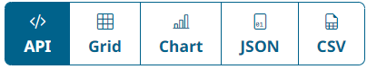
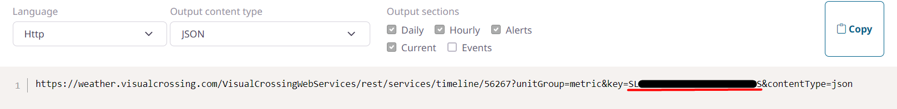

# Moon Status

Code to automatically update Discord status with the current lunar phase for personal use.

This small tool pulls weather data from [Visual Crossing Weather's](https://www.visualcrossing.com/resources/documentation/weather-api/timeline-weather-api/) Timeline Weather API to automatically retrieve the lunar phase for the current date and time at 12:00 and 00:00 Central Daylight Time and include an emoji representation of the current lunar phase in a Discord user's custom status.


# Requirements

Requires Python 3.X.X or greater and pip 24.X or greater, as well as the required packages below.

See [requirements.txt](requirements.txt). To install these, run:
```bash
pip install -r requirements.txt
```

# Usage

- Clone the repository:
```bash
git clone https://github.com/voxelwave/moon-status.git
```

- In the top-level project directory, create a file named `token.env` and paste a Discord client authentication token. [This video](https://www.youtube.com/watch?v=YEgFvgg7ZPI&ab_channel=GaugingGadgets) provides a nice tutorial for retrieving your own if you are logged in on a web browser.

:warning: Accessing and using a personal Discord authentication token is against Discord's Terms of Service, and as such, using this code puts you at risk of account deletion or suspension. I claim no responsibility for any of the consequences of others borrowing this code for personal use.

:warning: Never give or show your authentication token to someone else. These files are intentionally included in the project's `.gitignore` for security. This code only makes use of your authentication token for retrieving and updating custom status information, but please review the source code if you are hesitant about its security.

- Create a file named `weather_key.env` and paste a Visual Crossing API token. This code does not provide one - you will have to sign up for the service [here](https://www.visualcrossing.com/sign-up). Once logged in, from the Weather Query Builder, you can retrieve your API token by navigating to the "API" tab and copying the key from the code snippet provided there.




- Once both config files are set up, in a new terminal window at the top-level project directory, run the main file:
```bash
python3 main.py
```

From there, leave the code running as long as you'd like. To stop it, you can simply type `CTRL+C` (SIGINT) in the running terminal window.

# License

Copyright © 2024 Voxelwave. All rights reserved.

Distributed under the [MIT License](https://choosealicense.com/licenses/mit/).